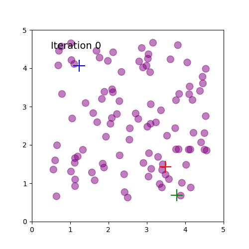
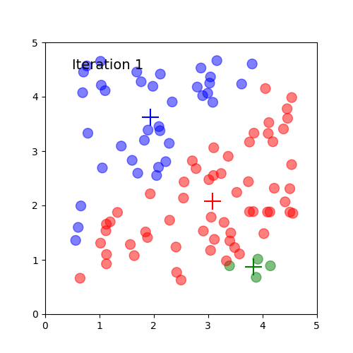
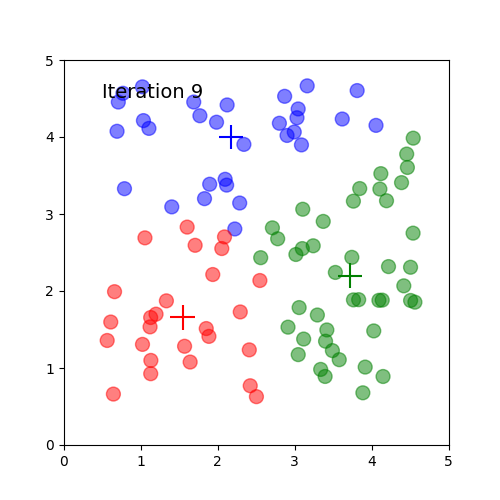

# K-means Illustrator
This python 3 script generates a sequence of plots illustrating how the [k-means] clustering algorithm works.
It also saves these plots in separate image files. 

I needed the images for an introductory presentation on machine learning, so I created this script and open sourced it.
Feel free to use it the way you want.  I would appreciate citation or attribution, though.

Run the script with:

```
python kmeans.py
```

The script has a few hard coded parameters with default values:

```
n_clusters = 3       # Number of clusters
n_points = 20        # Number of points
iterations = 10      # Number of iterations
dimensions = (5, 5)  # Dimension of the figure
```







This code is released under [the MIT Licence][mit].

Wesam Elshamy
http://wesamelshamy.com

[k-means]: https://en.wikipedia.org/wiki/K-means_clustering
[mit]: https://opensource.org/licenses/mit-license.php
